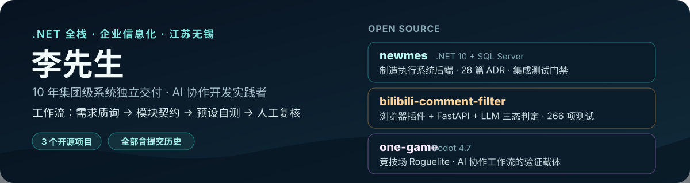

<p align="center">
  
</p>

10 年 .NET 全栈 / 企业信息化开发，现居江苏无锡。曾长期独立负责集团级审批流、财务报销、采购管理等核心业务系统（覆盖中国及亚太区 3000+ 员工，财务报销系统年单据量十几万级）。

2025-2026 转型 **AI 协作开发**：独立完成三个实践项目并全部开源，验证一套可持续的工作流。

## 工作流

```text
自己梳理需求与思路
        ↓
让 AI 反向质询，暴露遗漏与冲突
        ↓
确认方案，写成模块契约
        ↓
AI 在契约内实现，按预设方式自测
        ↓
人工复核，再进入下一轮
```

核心经验：把 AI 当作高吞吐的实现协作者，人保留需求判断、架构取舍、代码审查与最终验收。

## 开源项目

### [newmes](https://github.com/aasaa444/newmes) — 制造执行系统（.NET 10 + SQL Server）

工业路由器整机装配 MES 后端领域基础：ERP 订单幂等入站、执行快照冻结、物料事务账、产品 SN 追溯、版本化测试执行、质量保留与业务审计；以真实 SQL Server 集成测试作为发布门禁。仓库含 28 篇架构决策记录（ADR）与项目立项交付物。

### [bilibili-comment-filter](https://github.com/aasaa444/bilibili-comment-filter) — B 站评论过滤工具（Chrome 插件 + FastAPI + LLM）

插件采集并本地隐藏目标评论（UID），服务端调用 OpenAI 兼容模型给出「命中 / 非目标 / 不确定」三态判定，不确定项进入人工复核收件箱；支持策略版本化与样本库。前端 63 项、服务端 203 项自动化测试通过。

### [one-game](https://github.com/aasaa444/one-game) — One Game（Godot 4.7 竞技场 Roguelite）

以完整游戏原型验证轻量 AI 协作开发流程：角色、波次战斗、升级、商店构筑、武器合成、精英/Boss 与胜负结算的核心循环已落地。README 记录了从重型流程失败到轻量流程重建的完整复盘。

## 联系

- 邮箱：aasaa45454@gmail.com
- 现居：江苏无锡
